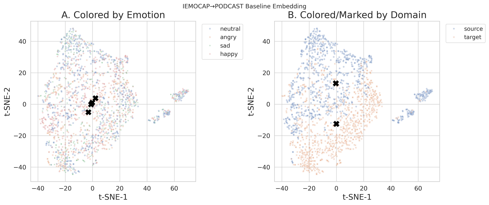
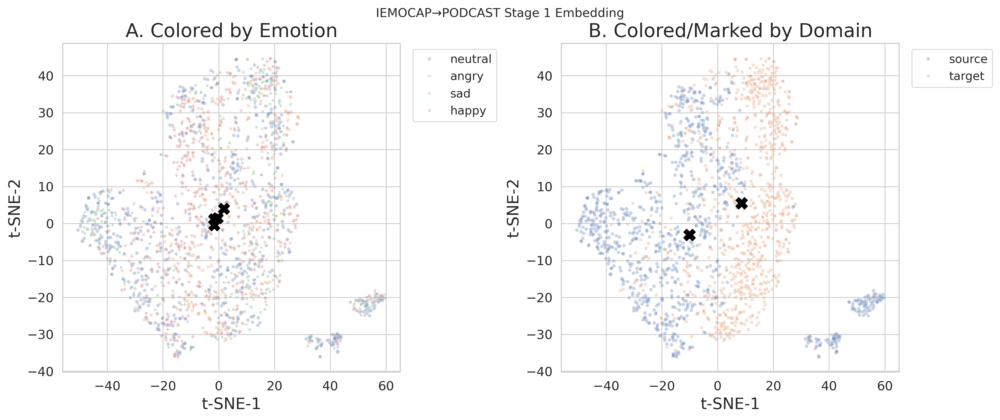
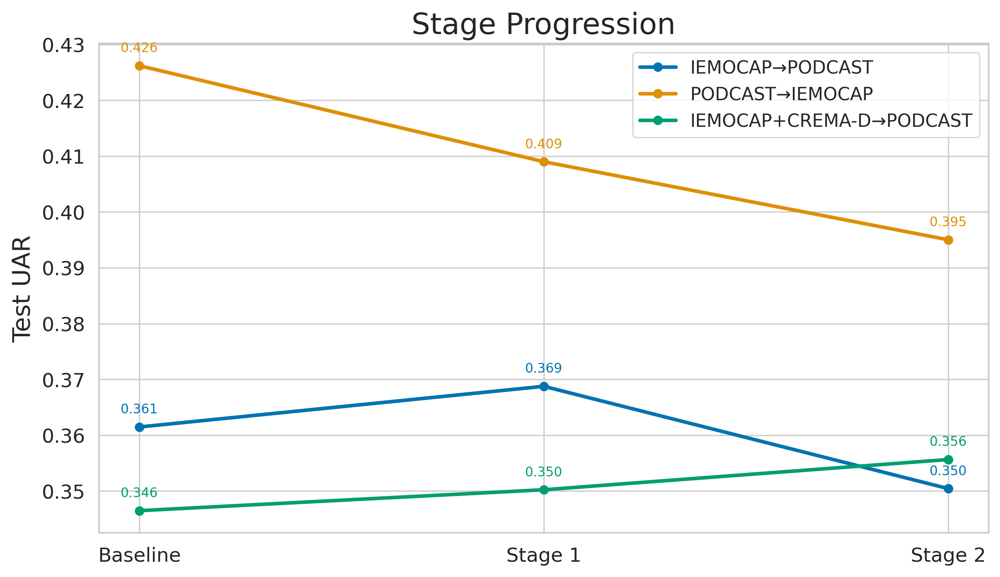
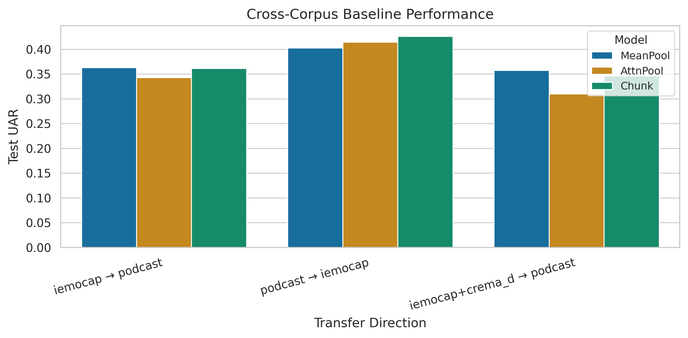
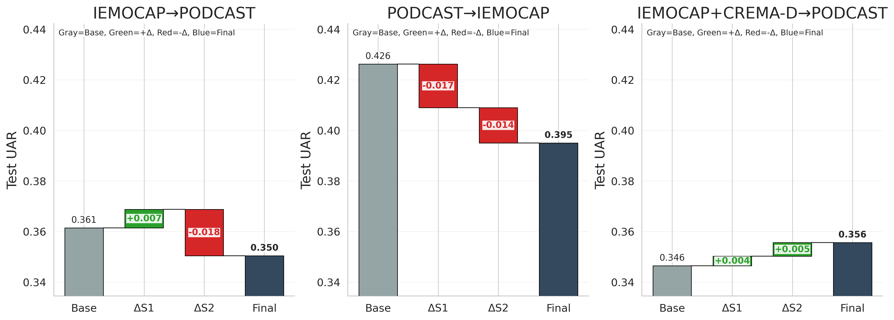
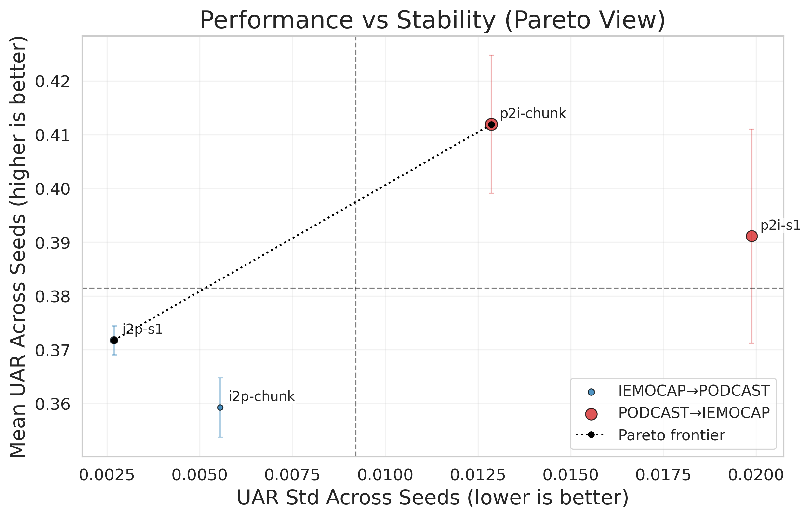
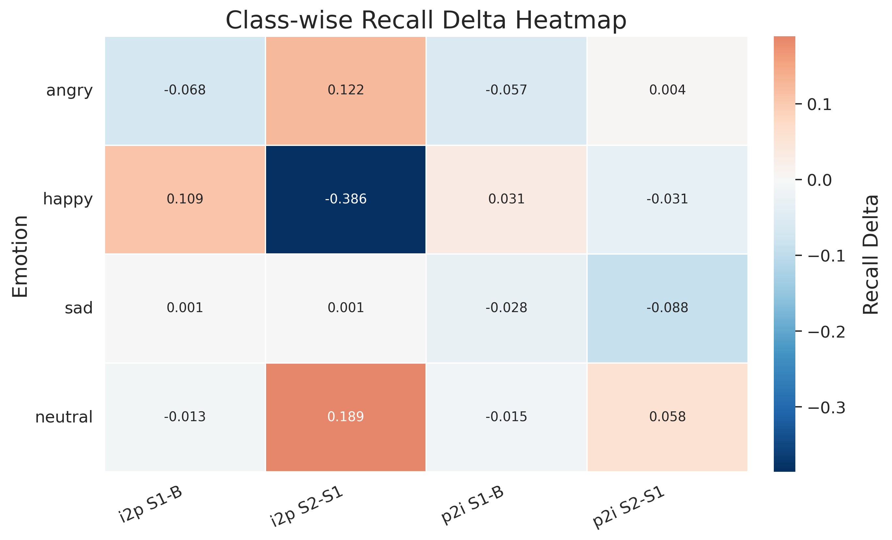
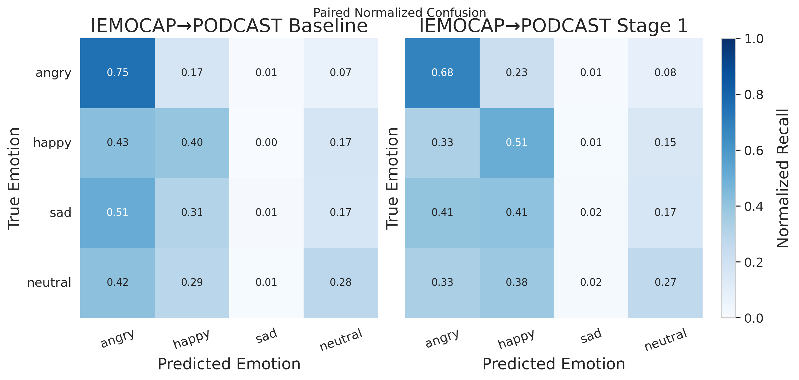

# Directional Asymmetry of Domain-Adversarial Adaptation in Cross-Corpus Speech Emotion Recognition

<p align="center">
  
  
</p>

<p align="center">
  <b>A reproducible research repository for studying when domain-adversarial alignment helps, when it fails, and why stronger alignment is not always better in cross-corpus speech emotion recognition.</b>
</p>

<p align="center">
  
  
  
  
  
</p>

---

## Paper

This repository supports the experiments, figures, tables, and reproducibility artifacts for the paper:

> **Directional Asymmetry of Domain-Adversarial Adaptation in Cross-Corpus Speech Emotion Recognition**

The paper studies a central question in cross-corpus speech emotion recognition:

> Does stronger domain-adversarial alignment always improve transfer across emotional speech corpora?

Our results suggest that the answer is **no**.  
The effect of domain-adversarial adaptation is strongly **direction-dependent** and can become harmful when local chunk-level alignment over-regularizes emotion-discriminative structure.

---

## Research Idea in One Figure

<p align="center">
  
</p>

The study compares three stages:

| Stage | Model | Purpose |
|---|---|---|
| Baseline | Chunk attention | Learn emotion from source corpus only |
| Stage 1 | Chunk + utterance-level adversarial alignment | Reduce global corpus mismatch |
| Stage 2 | Chunk + utterance-level and chunk-level adversarial alignment | Test whether stronger local alignment helps |

The key finding is that **Stage 1 can help selectively**, but **Stage 2 is not automatically better**.

---

## Why This Repository Exists

Most speech emotion recognition systems perform well when training and testing are done inside the same corpus. However, real deployment requires models to generalize across:

- recording conditions,
- speakers,
- speaking styles,
- acted vs. naturalistic emotion,
- annotation protocols,
- corpus-specific label distributions.

This repository provides a controlled experimental pipeline for examining these issues under a unified four-class emotion setting:

```text
angry / happy / sad / neutral
````

The focus is not simply to maximize one benchmark number.
The focus is to understand **how transfer direction and alignment granularity change cross-corpus SER behavior**.

---

## Main Experimental Setting

The experiments use three public English emotional speech corpora:

| Corpus      | Style          | Role in This Study                                |
| ----------- | -------------- | ------------------------------------------------- |
| IEMOCAP     | Acted / dyadic | In-corpus and acted source/target                 |
| MSP-PODCAST | Naturalistic   | Natural target/source                             |
| CREMA-D     | Acted          | Additional acted source for multi-source transfer |

After harmonization, all datasets are mapped into the same four-class label space.

<p align="center">
  
</p>

---

## Core Findings

### 1. Cross-corpus SER is direction-sensitive

Transfer from acted speech to naturalistic speech is not equivalent to the reverse direction.

| Direction                   | Best Baseline |   UAR |
| --------------------------- | ------------: | ----: |
| IEMOCAP → PODCAST           |      MeanPool | 0.363 |
| PODCAST → IEMOCAP           |         Chunk | 0.426 |
| IEMOCAP + CREMA-D → PODCAST |      MeanPool | 0.358 |

This means cross-corpus mismatch should not be treated as a single scalar difficulty.
The direction of transfer matters.

---

### 2. Utterance-level alignment helps only selectively

<p align="center">
  
</p>

In the acted-to-natural setting:

```text
IEMOCAP → PODCAST
Chunk baseline: 0.361
Stage 1:        0.369
Stage 2:        0.350
```

Stage 1 gives a small but consistent improvement.
Stage 2 then degrades performance, suggesting that stronger local alignment may suppress useful emotional structure.

---

### 3. Multi-seed evidence supports the directional pattern

<p align="center">
  
</p>

Multi-seed evaluation shows that Stage 1 is more stable in the IEMOCAP → PODCAST setting, but not in the opposite direction.

| Setting                   |  Mean UAR |   Std UAR | Mean Macro-F1 |
| ------------------------- | --------: | --------: | ------------: |
| IEMOCAP → PODCAST Chunk   |     0.359 |     0.005 |         0.311 |
| IEMOCAP → PODCAST Stage 1 | **0.372** | **0.003** |     **0.319** |
| PODCAST → IEMOCAP Chunk   | **0.412** | **0.013** |     **0.383** |
| PODCAST → IEMOCAP Stage 1 |     0.391 |     0.020 |         0.362 |

---

### 4. Class-wise effects are not uniform

<p align="center">
  
</p>

Adaptation does not improve all emotions equally.
The largest gains and losses are concentrated in specific classes, especially `happy` and `sad`.

This is important because aggregate UAR alone can hide major redistribution of recognition ability across emotions.

---

### 5. Confusion patterns reveal structured error redistribution

<p align="center">
  
</p>

In IEMOCAP → PODCAST, Stage 1 does not simply increase all diagonal entries.
Instead, it reorganizes the confusion structure, especially around neighboring emotional classes.

This supports the paper’s interpretation that adaptation changes the class topology of the decision space, not merely global accuracy.

---

### 6. Representation geometry changes after Stage 1

<p align="center">
  
  
</p>

The embedding visualizations show that Stage 1 reduces domain-level separation while preserving some emotion-related organization.

These plots are used as qualitative support only, not as standalone proof of domain invariance.

---

## Method Overview

The system uses a frozen `facebook/wav2vec2-base` acoustic frontend and compares three temporal aggregation strategies:

| Model    | Description                                       |
| -------- | ------------------------------------------------- |
| MeanPool | Global average over frame embeddings              |
| AttnPool | Linear attention over temporal frames             |
| Chunk    | Mean within local chunks, attention across chunks |

The domain-adaptive models are built on the chunk baseline:

```text
Stage 1:
  Chunk model
  + utterance-level domain adversarial head

Stage 2:
  Chunk model
  + utterance-level domain adversarial head
  + chunk-level domain adversarial head
```

The domain heads use gradient reversal during training and are removed at inference time.

---

## Key Implementation Settings

| Item              | Value                    |
| ----------------- | ------------------------ |
| Acoustic frontend | `facebook/wav2vec2-base` |
| Encoder update    | Frozen                   |
| Optimizer         | AdamW                    |
| Learning rate     | `2e-4`                   |
| Batch size        | `8`                      |
| Max duration      | `12.0 s`                 |
| Chunk size        | `1.0 s`                  |
| Chunk overlap     | `0.5 s`                  |
| Stage 1 weights   | `(1.0, 0.0)`             |
| Stage 2 weights   | `(1.0, 1.0)`             |
| Seeds             | `42`, `7`, `13`          |

---

## Repository Layout

```text
ser_project/
├── configs/
│   └── phase2/                         # YAML configs for all reported experiments
│
├── data/
│   ├── manifests/                      # harmonized metadata manifests
│   └── splits/                         # deterministic protocol splits
│
├── exp/                                # experiment outputs, logs, checkpoints
│
├── reports/                            # paper-ready figures, tables, audits, plot data
│   ├── fig_cross_corpus_barplot_v2.png
│   ├── fig_slope_stage_comparison.png
│   ├── fig_classwise_delta_heatmap.png
│   ├── fig_i2p_confusion_paired.png
│   ├── fig_embedding_chunk_baseline_v2.png
│   ├── fig_embedding_chunk_domain_utt_v2.png
│   ├── paper_table_in_corpus.csv
│   ├── paper_table_cross_corpus.csv
│   └── paper_table_stage1_stage2.csv
│
├── scripts/                            # training, evaluation, artifact generation
│
└── src/                                # dataset, model, pooling, trainer, GRL code
```

---

## Installation

```bash
cd ser_project

python -m venv .venv
source .venv/bin/activate

pip install -r requirements.txt
```

When running scripts directly, use:

```bash
export PYTHONPATH=.
```

or prefix commands with:

```bash
PYTHONPATH=.
```

---

## Data Preparation

The preprocessing pipeline standardizes metadata, audio format, label mapping, and protocol splits.

```bash
PYTHONPATH=. python scripts/inspect_datasets.py \
  --report-path reports/dataset_schema_report.txt

PYTHONPATH=. python scripts/prepare_datasets.py \
  --project-root .

PYTHONPATH=. python scripts/preprocess_audio.py \
  --project-root . \
  --target-sr 16000 \
  --min-duration 1.0 \
  --max-duration 12.0

PYTHONPATH=. python scripts/create_splits.py \
  --project-root . \
  --seed 42
```

Primary outputs:

```text
data/manifests/all_metadata_processed.csv
data/splits/protocol_a_in_corpus/
data/splits/protocol_b_one_to_one/
data/splits/protocol_c_multi_source/
```

---

## Training

### In-corpus baselines

```bash
PYTHONPATH=. python scripts/train.py \
  --config configs/phase2/iemocap_in_corpus_attnpool.yaml

PYTHONPATH=. python scripts/train.py \
  --config configs/phase2/podcast_in_corpus_attnpool.yaml
```

### Cross-corpus baselines

```bash
PYTHONPATH=. python scripts/train.py \
  --config configs/phase2/iemocap_to_podcast_chunk.yaml

PYTHONPATH=. python scripts/train.py \
  --config configs/phase2/podcast_to_iemocap_chunk.yaml
```

### Stage 1: utterance-level domain adversarial adaptation

```bash
PYTHONPATH=. python scripts/train.py \
  --config configs/phase2/iemocap_to_podcast_chunk_domain_utt.yaml
```

### Stage 2: utterance + chunk-level domain adversarial adaptation

```bash
PYTHONPATH=. python scripts/train.py \
  --config configs/phase2/iemocap_to_podcast_chunk_domain_both.yaml
```

---

## Evaluation

```bash
PYTHONPATH=. python scripts/evaluate.py \
  --config <config_path>
```

All reported figures and tables are generated from saved experiment outputs rather than manually entered values.

---

## Experiment Matrix

### In-corpus evaluation

| Corpus  | MeanPool | AttnPool | Chunk |
| ------- | -------- | -------- | ----- |
| IEMOCAP | yes      | yes      | yes   |
| PODCAST | yes      | yes      | yes   |

### One-to-one cross-corpus transfer

| Direction         | MeanPool | AttnPool | Chunk | Stage 1 | Stage 2 |
| ----------------- | -------- | -------- | ----- | ------- | ------- |
| IEMOCAP → PODCAST | yes      | yes      | yes   | yes     | yes     |
| PODCAST → IEMOCAP | yes      | yes      | yes   | yes     | yes     |

### Multi-source transfer

| Direction                   | MeanPool | AttnPool | Chunk | Stage 1 | Stage 2 |
| --------------------------- | -------- | -------- | ----- | ------- | ------- |
| IEMOCAP + CREMA-D → PODCAST | yes      | yes      | yes   | yes     | yes     |

### Additional analyses

| Analysis                           | Purpose                                            |
| ---------------------------------- | -------------------------------------------------- |
| Multi-seed robustness              | Test whether trends are stable across random seeds |
| Target-unlabeled fraction ablation | Test sensitivity to target data exposure           |
| Source-fraction ablation           | Test dependence on labeled source strength         |
| Stage 2 ablations                  | Test whether chunk-level alignment weight matters  |
| Class-wise recall analysis         | Reveal emotion-specific gains and losses           |
| Confusion analysis                 | Inspect structured error redistribution            |
| Embedding visualization            | Qualitatively inspect domain/emotion geometry      |

---

## Paper Artifact Generation

Generate core paper tables and audits:

```bash
PYTHONPATH=. python scripts/generate_paper_tabular_artifacts.py
PYTHONPATH=. python scripts/generate_paper_implementation_audit.py
PYTHONPATH=. python scripts/generate_paper_evidence_check.py
```

Generate high-information figures:

```bash
PYTHONPATH=. python scripts/generate_pareto_performance_stability.py
PYTHONPATH=. python scripts/generate_ablation_impact_tornado.py
PYTHONPATH=. python scripts/generate_rank_shift_metrics.py
PYTHONPATH=. python scripts/generate_paper_figures_v2.py
```

---

## Important Report Files

### Core paper tables

```text
reports/paper_table_in_corpus.csv
reports/paper_table_cross_corpus.csv
reports/paper_table_stage1_stage2.csv
```

### Implementation and validation audits

```text
reports/paper_implementation_details.md
reports/paper_validation_protocol_audit.md
reports/paper_evidence_check.md
reports/paper_in_corpus_audit.md
reports/paper_dataset_statistics_audit.md
```

### Plot-ready data

```text
reports/plotdata_multiseed_robustness.csv
reports/plotdata_pareto_performance_stability.csv
reports/plotdata_ablation_impact_tornado.csv
reports/plotdata_rank_shift_metrics.csv
reports/plotdata_classwise_delta_heatmap.csv
```

---

## Reproducibility Notes

This repository is designed so that the paper artifacts can be traced back to saved experiment outputs.

* All experiments are config-driven through `configs/phase2/*.yaml`.
* Resolved runtime configurations are saved with experiment outputs.
* Splits are deterministic once the seed is fixed.
* Cross-corpus checkpoint selection uses source-side dev UAR.
* Target emotion labels are not used for early stopping or model selection.
* Target-domain samples are used as unlabeled examples only in domain-adversarial training.
* Figure-generation scripts read from exported CSV and metric files.

---

## What This Repository Shows

This project is not only a model repository.
It is an empirical study of a failure mode in cross-corpus SER:

> Stronger alignment can reduce domain mismatch, but it can also erase emotion-discriminative structure.

The practical implication is that cross-corpus SER should not blindly maximize domain invariance.
Instead, adaptation should be:

* direction-sensitive,
* class-aware,
* temporally selective,
* and supported by multi-seed and class-wise diagnostics.

---

## Citation

If this repository contributes to your work, please cite:

```bibtex
@article{altaibek2026directional,
  title={Directional Asymmetry of Domain-Adversarial Adaptation in Cross-Corpus Speech Emotion Recognition},
  author={Altaibek, Mamyr and Yergesh, Banu and Zulkhazhav, Altanbek},
  journal={IEEE Access},
  year={2026},
  note={Manuscript under preparation}
}
```

---

## Authors

**Mamyr Altaibek**
Department of Digital Development, L.N. Gumilyov Eurasian National University
Astana, Kazakhstan

**Banu Yergesh**
Department of Digital Development, L.N. Gumilyov Eurasian National University
Astana, Kazakhstan

**Altanbek Zulkhazhav**
Department of Digital Development, L.N. Gumilyov Eurasian National University
Astana, Kazakhstan

---

## License and Dataset Notice

This repository contains code, configuration files, generated result summaries, and paper-support artifacts.
The original speech corpora are not redistributed in this repository. Users must obtain IEMOCAP, MSP-PODCAST, and CREMA-D from their official providers and follow the corresponding dataset licenses and access conditions.

---

## Contact

For questions about the experiments or reproducibility artifacts, please open an issue in this repository.
